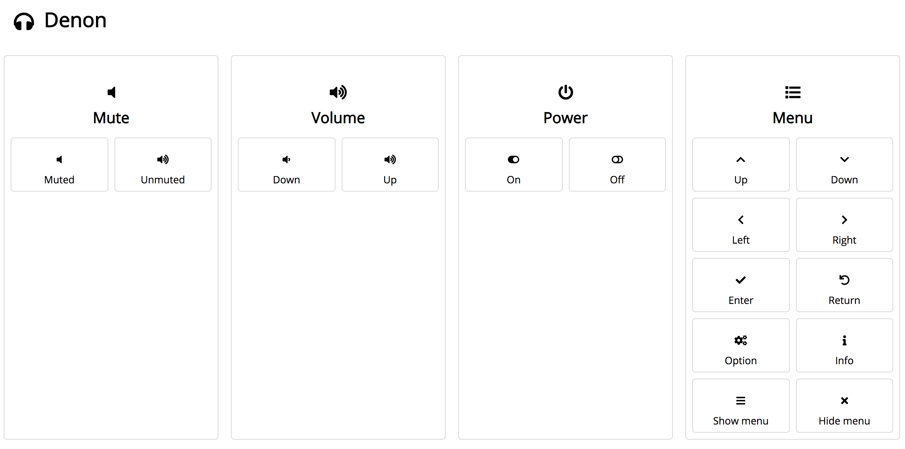

# denon

A flexible, browser-based controller for Denon A/V Receivers in Django + Vue.js



## Installation

```shell
$ git clone git@github.com:daneah/denon.git
$ cd denon/
$ pipenv install
$ cat << EOF > .env
SECRET_KEY=denon
DEBUG=TRUE
DENON_IP_ADDRESS=<your Denon's IP address>
EOF
$ pipenv run ./manage.py migrate
$ pipenv run ./manage.py createsuperuser
$ cd frontend/
$ npm install
```


## Running

In one window:

```shell
$ pipenv run ./manage.py runserver
```

In another window:

```shell
$ cd frontend
$ npm run serve
```


## Using

The frontend is set up to proxy requests to the backend,
so with the frontend and backend servers running
you can visit http://localhost:8080 to see the interface.

To add commands and parameters that are supported by your DENON,
go to http://localhost:8000/admin.

Commands and parameters can select an icon from the [free Font Awesome gallery](https://fontawesome.com/icons?d=gallery&m=free).


## Coming eventually

* Dockerfile and Kubernetes YAML file as a "quickstart" option.
* Live status of commands that support it, such as Mute and Power.
